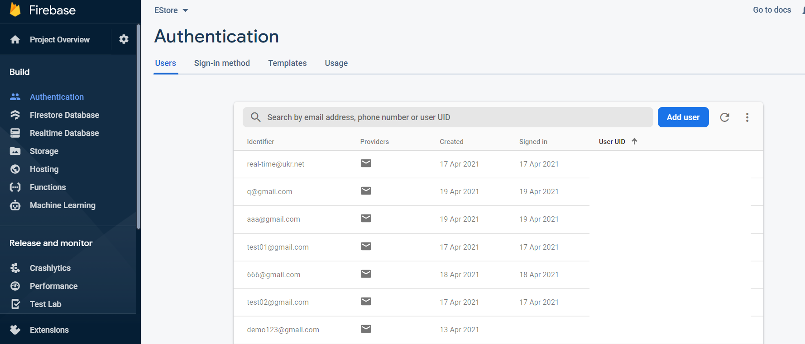
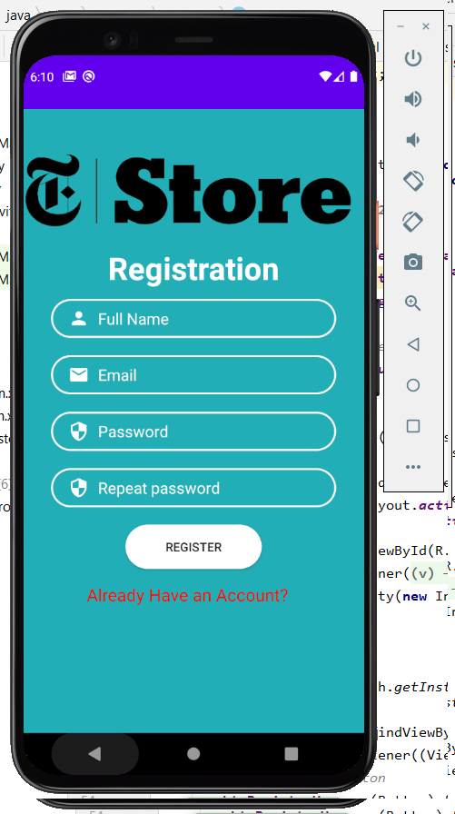

# :white_check_mark: Login-Registration-for-Android
Activity Login/Registration + Google Sign In Button for Android (Java/Firebase). Also have simple validation !!

Description : 
Its first Two Activity (Login/Registration + Google Sign In Button ) which written in Java it's part of my future eCommerce project eMarket . Use also Firebase and Gradle
____
# :white_check_mark: Firebase Auth
Read more about Firebase Auth
[Firebase](https://firebase.google.com/docs/auth/android/firebaseui) 
**I removed on these images the User UID**

____
# :white_check_mark: Login 

____
# :white_check_mark: Registration 

